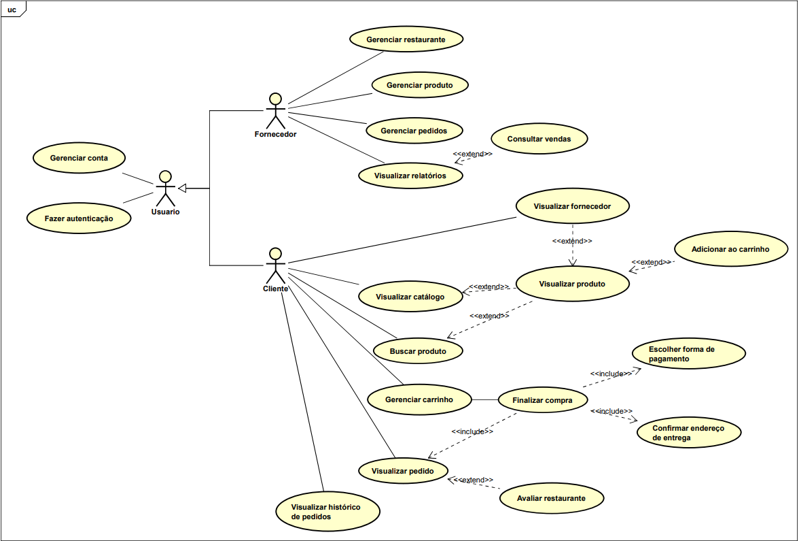

 <h1> aiLarica 

## Sumário

- [Sumário](#sumário)
- [1. Introdução](#1-introdução)
- [2. Objetivo](#2-objetivo)
- [3. Público-Alvo](#3-público-alvo)
- [4. Documentos gerais no repositório](#4-documentos-gerais-no-repositório)
  - [4.1. Requisitos](#41-requisitos)
  - [Diagrama de Casos de Uso](#diagrama-de-casos-de-uso)
    - [Relação dos Atores](#relação-dos-atores)
    - [Relação dos Casos de Uso](#relação-dos-casos-de-uso)
    - [**UC1.1 - Cadastrar conta**](#uc11---cadastrar-conta)
    - [**UC7.1.1 - Adicionar ao carrinho**](#uc711---adicionar-ao-carrinho)
    - [**UC6 - Visualizar relatórios**](#uc6---visualizar-relatórios)
    - [**UC4.2 - Atualizar produto**](#uc42---atualizar-produto)
    - [**UC2 - Fazer Autenticação**](#uc2---fazer-autenticação)
- [Tecnologias Utilizadas](#tecnologias-utilizadas)
- [Autores](#autores)

## 1. Introdução

**aiLarica** é uma plataforma de delivery de comida projetada para integrar todas as etapas do processo de pedidos, desde a visualização do catálogo até o pagamento. O sistema visa atender consumidores que buscam conveniência e empresas que desejam gerenciar melhor seus produtos e vendas.

Este projeto foi desenvolvido para a disciplina **Programação Orientada a Objetos II (POO2)**, ministrada pela professora **Gisele**, na **Universidade Tecnológica Federal do Paraná (UTFPR), campus Cornélio Procópio - PR**.

## 2. Objetivo

O sistema tem como objetivo proporcionar uma experiência eficiente e intuitiva para usuários, melhorando o processo de pedidos e otimizando o gerenciamento para fornecedores.

## 3. Público-Alvo

- **Consumidores finais**: Buscam praticidade e rapidez para realizar pedidos.
- **Empresas e fornecedores de alimentos**: Desejam gerenciar seus produtos e vendas de maneira eficaz.

## 4. Documentos gerais no repositório

### 4.1. Requisitos

| ID   | Requisitos Funcionais                                                                                     | Prioridade |
|:----:|:---------------------------------------------------------------------------------------------------------:|:----------:|
| RF01 | O sistema deve permitir que os usuários se cadastrem informando nome, e-mail, telefone e endereço. | ALTA       |
| RF02 | O sistema deve permitir que usuários autenticados façam login utilizando e-mail e senha.       | ALTA       |
| RF03 | O sistema deve permitir que usuários cadastrados alterem suas credenciais.                     | BAIXA      |
| RF04 | O sistema deve permitir que os fornecedores se cadastrem informando os documentos necessários. | ALTA       |
| RF05 | O sistema deve permitir que os usuários consultem e visualizem informações sobre os fornecedores. | MÉDIA      |
| RF06 | O sistema deve disponibilizar o cadastro de produtos, com nome, descrição, preço, quantidade em estoque e categoria. | ALTA       |
| RF07 | O sistema deve permitir que os usuários visualizem o catálogo de produtos organizados em categorias. | ALTA       |
| RF08 | O sistema deve permitir que o usuário adicione produtos ao carrinho, visualize e gerencie o carrinho antes de finalizar o pedido. | ALTA       |
| RF09 | O sistema deve permitir que o usuário finalize a compra escolhendo um método de pagamento e confirmando o endereço de entrega. | ALTA       |
| RF10 | O sistema deve disponibilizar o acompanhamento de cada transação, desde a seleção do produto até a finalização da compra. | MÉDIA      |
| RF11 | O sistema deve permitir que o usuário visualize o histórico de seus pedidos realizados, com detalhes sobre produtos, datas e status. | MÉDIA      |
| RF12 | O sistema deve permitir que fornecedores associem seus produtos e gerenciem suas informações.   | ALTA       |
| RF13 | O sistema deve disponibilizar para o fornecedor consultas e relatórios detalhados sobre vendas, produtos em estoque e pedidos realizados. | MÉDIA      |
| RF14 | O sistema deve oferecer uma funcionalidade para o usuário rastrear o status do pedido, desde o preparo até a entrega. | BAIXA      |
| RF15 | O sistema deve permitir que clientes avaliem os restaurantes.                                   | BAIXA      |

 

| ID   | Requisitos Não-Funcionais                                                                                | Tipo            |
|:----:|:--------------------------------------------------------------------------------------------------------:|:---------------:|
| RNF01 | O sistema deve ser desenvolvido em Java.                                                     | Implementação   |
| RNF02 | O sistema deve estar disponível para desktop e mobile, sendo acessível em todos os navegadores. | Portabilidade   |
| RNF03 | O sistema deve estar disponível 24 horas, 7 dias por semana.                                 | Disponibilidade |
| RNF04 | O sistema deve armazenar os produtos, pedidos e usuários em um banco de dados relacional.    | Implementação   |
| RNF05 | O sistema deve ser capaz de processar até 1000 pedidos simultâneos sem degradar o tempo de resposta. | Desempenho      |
| RNF06 | O sistema deve proteger os dados dos usuários, utilizando protocolos de criptografia.        | Segurança       |
| RNF07 | O sistema deve ser escalável para suportar o crescimento de usuários e volume de pedidos.    | Escalabilidade  |
| RNF08 | O sistema deve oferecer uma interface intuitiva e de fácil navegação.                        | Usabilidade     |
| RNF09 | O tempo de resposta para carregamento de páginas e operações não deve exceder 2 segundos.    | Desempenho      |
| RNF10 | O sistema deve estar disponível 99% do tempo, com períodos de manutenção programada.         | Confiabilidade  | 

### Diagrama de Casos de Uso

#### Relação dos Atores

| ID  | Nome do Ator | Descrição                                                                 |
|:---:|:------------:|:-------------------------------------------------------------------------:|
| A1  | Usuário      | Ator genérico para os atores Fornecedor e Cliente.                       |
| A2  | Fornecedor   | Ator responsável pelo gerenciamento de restaurantes, produtos e pedidos. |
| A3  | Cliente      | Ator responsável por gerenciar carrinho e visualizar pedidos.            |

---

#### Relação dos Casos de Uso

| ID    | Nome do Caso de Uso         |
|:-----:|:---------------------------:|
| UC1   | Gerenciar conta             |
| UC1.1 | Cadastrar conta             |
| UC1.2 | Alterar conta               |
| UC1.3 | Excluir conta               |
| UC1.4 | Consultar conta             |
| UC2   | Fazer Autenticação          |
| UC3   | Gerenciar restaurante       |
| UC3.1 | Cadastrar restaurante       |
| UC3.2 | Alterar restaurante         |
| UC3.3 | Excluir restaurante         |
| UC3.4 | Consultar restaurante       |
| UC4   | Gerenciar produto           |
| UC4.1 | Cadastrar produto           |
| UC4.2 | Alterar produto             |
| UC4.3 | Excluir produto             |
| UC4.4 | Consultar produto           |
| UC5   | Gerenciar pedidos           |
| UC5.1 | Cadastrar pedidos           |
| UC5.2 | Alterar pedidos             |
| UC5.3 | Excluir pedidos             |
| UC5.4 | Consultar pedidos           |
| UC6   | Visualizar relatórios       |
| UC6.1 | Consultar vendas            |
| UC7   | Visualizar fornecedor       |
| UC7.1 | Visualizar produto          |
| UC7.1.1 | Adicionar ao carrinho    |
| UC8   | Visualizar catálogo         |
| UC9   | Buscar produto              |
| UC10  | Gerenciar carrinho          |
| UC10.1 | Cadastrar pedidos          |
| UC10.2 | Alterar pedidos            |
| UC10.3 | Excluir pedidos            |
| UC10.4 | Consultar pedidos          |
| UC10.5 | Finalizar compra           |
| UC10.5.1 | Escolher forma de pagamento |
| UC10.5.2 | Confirmar endereço de entrega |
| UC11  | Visualizar pedido           |
| UC11.1 | Avaliar restaurante        |
| UC12  | Visualizar histórico de pedidos |

 <b>Especificação dos Casos de Uso</b> 

#### **UC1.1 - Cadastrar conta**

**Fluxo Normal:**

| ID do Caso de Uso | UC1.1          |
|-------------------|----------------|
| ID do Cenário     | 1              |
| Nome do Cenário   | Cadastrar conta |
| Sequência de Eventos | - O usuário envia seus dados pessoais.   - O sistema verifica se o login já existe.   - O sistema valida os dados do usuário.   - O sistema salva os dados do usuário e gera um número identificador.   - O sistema emite uma mensagem de sucesso. |

**Caminhos Alternativos:**

| ID do Caminho Alternativo | Descrição                                                                                           |
|---------------------------|---------------------------------------------------------------------------------------------------|
| 1                         | Se algum dos dados obrigatórios não for informado, o sistema emite um aviso e o cadastro não é efetuado. |
| 2                         | Se houver outro cadastro com as mesmas informações, um aviso é emitido e o cadastro não é efetuado. |

---

#### **UC7.1.1 - Adicionar ao carrinho**

**Fluxo Normal:**

| ID do Caso de Uso | UC7.1.1            |
|-------------------|--------------------|
| ID do Cenário     | 2                  |
| Nome do Cenário   | Adicionar ao carrinho |
| Sequência de Eventos | - O usuário seleciona a opção de adicionar o produto ao carrinho.   - O usuário seleciona a quantidade que será adicionada.   - O sistema verifica se a quantidade está disponível.   - O sistema adiciona o produto ao carrinho.   - O sistema emite uma mensagem de sucesso. |

**Caminho Alternativo:**

| ID do Caminho Alternativo | Descrição                                                                                     |
|---------------------------|---------------------------------------------------------------------------------------------|
| 1                         | Se a quantidade selecionada pelo usuário for maior que a quantidade disponível em estoque, um aviso é emitido e o produto não é adicionado. |

---

#### **UC6 - Visualizar relatórios**

**Fluxo Normal:**

| ID do Caso de Uso | UC6                    |
|-------------------|------------------------|
| ID do Cenário     | 3                      |
| Nome do Cenário   | Visualizar relatórios  |
| Sequência de Eventos | - O fornecedor seleciona a opção de visualizar relatórios, de acordo com a categoria.   - O fornecedor seleciona o intervalo de data de início e fim para fazer a busca de relatórios.   - O sistema verifica se a ordem das datas está correta.   - O sistema verifica se existem dados naquele período.   - O sistema apresenta os relatórios correspondentes. |

**Caminhos Alternativos:**

| ID do Caminho Alternativo | Descrição                                                                                                     |
|---------------------------|-------------------------------------------------------------------------------------------------------------|
| 1                         | Se nenhuma data for preenchida, o sistema deve apresentar o relatório geral do restaurante.                 |
| 2                         | Se a data final anteceder a de início, o sistema deve emitir um aviso e o relatório não é apresentado.       |
| 3                         | Se não houver dados para o relatório, o sistema deve emitir um aviso que não há relatório para aquele período. |

---

#### **UC4.2 - Atualizar produto**

**Fluxo Normal:**

| ID do Caso de Uso | UC4.2                  |
|-------------------|------------------------|
| ID do Cenário     | 4                      |
| Nome do Cenário   | Atualizar produto      |
| Sequência de Eventos | - O fornecedor seleciona a opção atualizar produto.   - O fornecedor entra com o ID do produto.   - O sistema verifica se o ID passado pelo usuário corresponde ao ID de algum produto cadastrado.   - O fornecedor envia os novos dados do produto.   - O sistema valida os novos dados.   - O sistema atualiza as informações do produto no banco de dados. |

**Caminhos Alternativos:**

| ID do Caminho Alternativo | Descrição                                                                                           |
|---------------------------|---------------------------------------------------------------------------------------------------|
| 1                         | Se o produto não for encontrado, o sistema deve emitir uma mensagem de erro que informe isso.    |
| 2                         | Se algum dos dados obrigatórios não for informado, o sistema emite um aviso e o cadastro não é efetuado. |
| 3                         | Se houver outro cadastro com as mesmas informações, um aviso é emitido e o cadastro não é efetuado. |

---

#### **UC2 - Fazer Autenticação**

**Fluxo Normal:**

| ID do Caso de Uso | UC2                     |
|-------------------|-------------------------|
| ID do Cenário     | 5                       |
| Nome do Cenário   | Fazer Autenticação      |
| Sequência de Eventos | - O usuário envia suas informações de login.   - O sistema valida as informações de login.   - O sistema libera o acesso à conta do usuário. |

**Caminhos Alternativos:**

| ID do Caminho Alternativo | Descrição                                                                                     |
|---------------------------|---------------------------------------------------------------------------------------------|
| 1                         | Se os campos obrigatórios não estiverem preenchidos, o sistema deve emitir um aviso.        |
| 2                         | Se as credenciais enviadas não estiverem corretas, o sistema deve emitir um aviso.          |

---

## Tecnologias Utilizadas

- **Linguagem de programação**: Java
- **Banco de dados**: PostgreSQL
- **Plataforma**: Desktop e mobile

## Autores

- **Abner do Nascimento Santos**
- **Carlos Eduardo Pires de Santana Hereman**
- **Luccas Maia Hessel**

